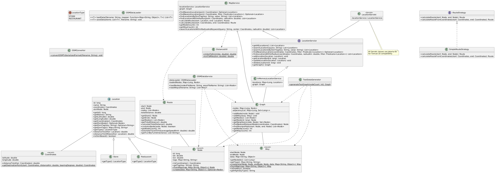

# StoreMapper Architecture

## Class Diagram

For a SVG version, [click here](images/ClassDiagramPostOSM.svg).

The source PlantUML file for this diagram can be found [here](ClassDiagramPostOSM.puml).

## Overview

StoreMapper is a web-based application designed to manage and visualize location data, with a focus on stores and restaurants. It integrates OpenStreetMap (OSM) data structures to provide robust mapping and routing capabilities. The architecture is designed for modularity, extensibility, and efficient handling of large-scale geographical data.

## Key Components

### Data Models

1. **`Location` (Abstract Class)**
   - Base class for all locations, now including OSM node data.
   - Contains properties like `id`, `name`, `coordinates`, and `osmNode`.
   - Provides methods for OSM tag access and distance calculations.

2. **`Store` and `Restaurant` (Concrete Classes)**
   - Extend the `Location` class, representing specific types of locations.

3. **`Node` and `Way` (Records)**
   - Represent OSM data structures for points and paths respectively.
   - `Node` includes geographical coordinates and tags.
   - `Way` represents connections between nodes, including metadata like one-way status and highway type.

4. **`Coordinates` (Record)**
   - Encapsulates latitude and longitude.
   - Provides methods for distance calculation.

5. **`Graph`**
   - Represents the OSM road network.
   - Manages nodes and their connections (ways).
   - Supports pathfinding and nearest node queries.

6. **`Route`**
   - Represents a calculated route between two points.
   - Includes methods for travel time estimation and turn-by-turn directions.

### Services

1. **`LocationService` (Interface)**
   - Defines methods for CRUD operations on locations and advanced queries.

2. **`InMemoryLocationService`**
   - Implements `LocationService` using in-memory storage and the OSM graph.

3. **`MapService`**
   - Core service that combines location data with spatial operations.
   - Utilizes the OSM graph for advanced routing and spatial queries.

4. **`OSMDataService`**
   - Handles loading and processing of OSM data.

5. **`RouteStrategy` (Interface) and `SimpleRouteStrategy`**
   - Define and implement route calculation algorithms.

### Data Processing

1. **`OSMDataLoader`**
   - Loads OSM data from serialized formats.

2. **`OSMConverter`**
   - Converts raw OSM XML data to a more efficient serialized format.

### Web Components

1. **`LocationServlet`**
   - Handles HTTP requests related to locations.
   - Acts as a controller, delegating business logic to services.

### Utility Classes

1. **`TestDataGenerator`**
   - Generates sample data for testing, including OSM-based graphs.

2. **`DistanceUtil`**
   - Provides utility methods for distance conversions.

## Data Flow

1. OSM data is processed by `OSMConverter` and loaded into the system using `OSMDataLoader`.
2. `OSMDataService` creates a `Graph` representation of the road network.
3. `InMemoryLocationService` manages `Location` objects and interacts with the `Graph`.
4. `MapService` uses `LocationService` and `Graph` for spatial queries and route calculations.
5. User requests are handled by `LocationServlet`, which delegates to appropriate services.
6. Calculated routes and location data are sent back to the client for display.

## Design Decisions

1. **Integration of OSM Data**: Allows for more accurate and detailed mapping and routing capabilities.
2. **Use of Graph Structure**: Enables efficient pathfinding and spatial queries on large datasets.
3. **Separation of Concerns**: Clear distinction between data models, services, and web components.
4. **Abstraction and Interfaces**: Allows for flexibility in implementing different routing algorithms and data sources.
5. **Record Classes**: Utilizes Java 14+ record feature for immutable data classes (Node, Way, Coordinates).

## Future Considerations

1. Implement more advanced routing algorithms (e.g., A* search).
2. Enhance data loading capabilities to handle larger OSM datasets efficiently.
3. Implement caching mechanisms for frequently accessed routes and locations.
4. Develop a more sophisticated UI for route display and interaction.
5. Integrate real-time traffic data for more accurate route calculations.
6. Implement a persistent storage solution (e.g., database) for location data.